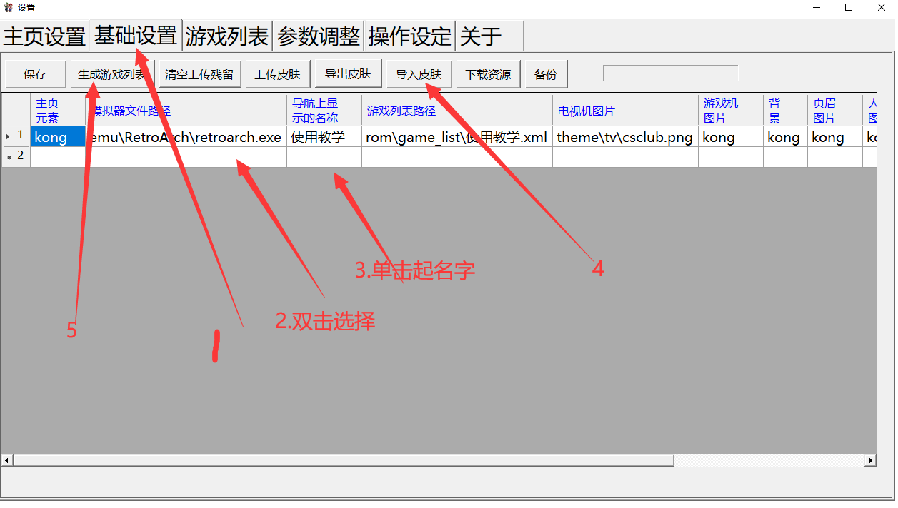

添加游戏
====================================
启动梦童年软件后按键盘的F12调出设置界面或者直接双击shezhi.exe

1.选择基础设置选项卡

2.添加模拟器有些模拟器需要添加启动参数
    例如wiiu模拟器需要最后填空格-G
    mame模拟器和fbneo则不需要添加

3.给该分类起一个名字比如FC MD之类

4.导入皮肤或者根据自己的喜好添加指定的图片（表格中后面的选项-双击添加）也可导入已经设计好的皮肤

5.生成游戏列表（继续看下面的说明）

6.保存之后关闭即可

7.生成游戏列表
    1.可以使用基础设置里的生成按钮
        缺点需要一项一项的选择。

        优点可将资源自由放置。

        .. image:: 3.png
            :align: center
            :alt: 添加游戏 

    2.保存基础设置的分类之后会再ROM文件夹下自动生成对应的文件夹
        1. 如分类名称为fc则自动保存后自动生成fc分类和文件夹放入对应的资料       

        .. image:: 4.png
            :align: center
            :alt: 添加游戏    

        2. 选择游戏列表选项卡后点击选择需要添加游戏的分类最后点击批量添加游戏rom

            缺点游戏列表需要至少有一条记录

            优点添加简单可复制路径甚至一键完成添加

        .. image:: 5.png
            :align: center
            :alt: 添加游戏 

        .. image:: 6.png
            :align: center
            :alt: 添加游戏 

